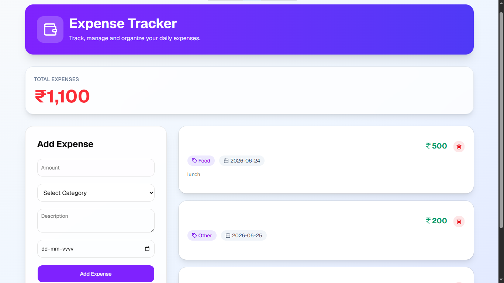

# 💰 Expense Tracker

A simple and responsive Expense Tracker built using **React**, **Vite**, **Tailwind CSS**, and **shadcn/ui**.

## 🚀 Features

* Add new expenses
* Select expense category
* Add description
* Choose expense date
* Responsive and clean UI

## 🛠️ Tech Stack

* React
* Vite
* Tailwind CSS
* shadcn/ui
* Lucide React

## 📸 Screenshot

> Add your project screenshot here.




## 📦 Installation

```bash
git clone https://github.com/your-username/expense-tracker.git

cd expense-tracker

npm install

npm run dev
```

## 📁 Folder Structure

```text
expense-tracker/
│── src/
│── public/
│── package.json
│── vite.config.js
└── README.md
```

## 👩‍💻 Author

**Pranali**

---

⭐ If you like this project, give it a star on GitHub!
